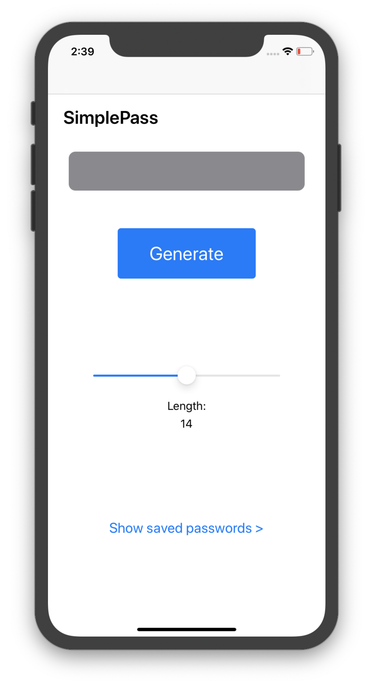
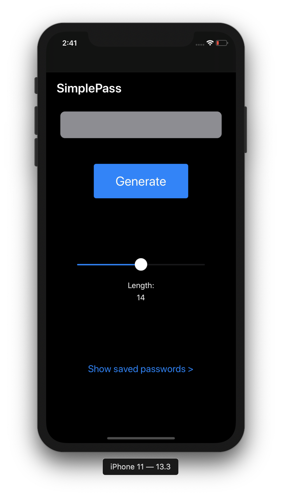
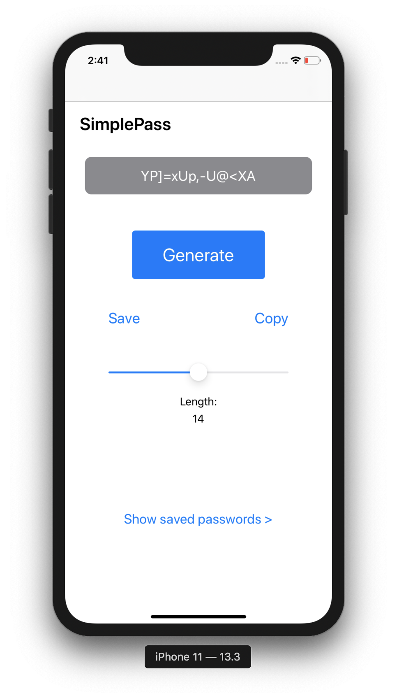
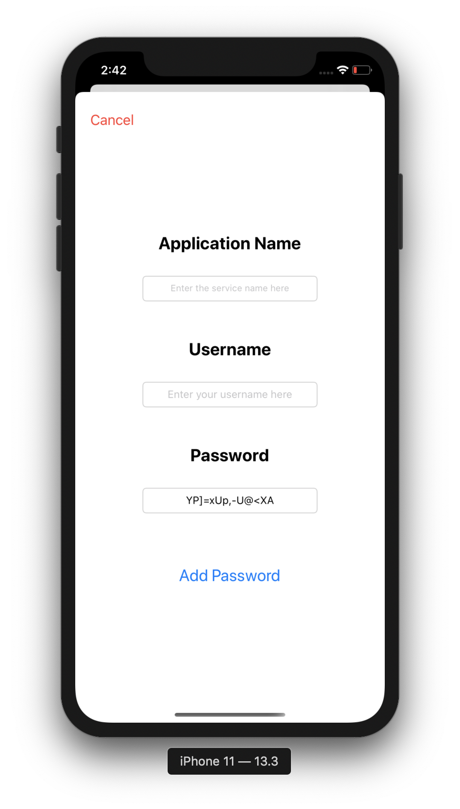
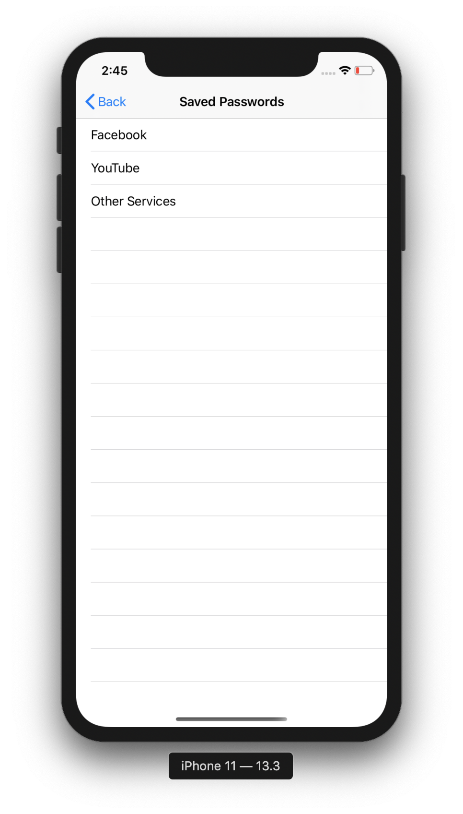
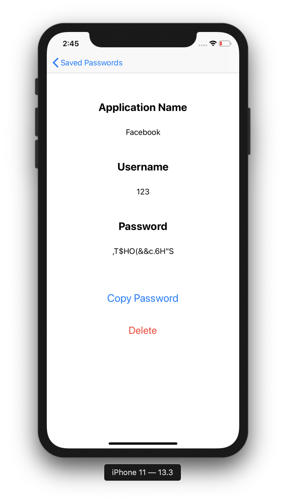

# SimplePass

  

A simple iOS app for creating and storing passwords, created mostly for my own use and learning purposes.

Right now it supports only iPhones.
Original app icon (key shape) taken from <a href="https://www.flaticon.com/authors/freepik" title="Freepik">Freepik</a> at <a href="https://www.flaticon.com/" title="Flaticon"> www.flaticon.com</a> and edited by me.

The app uses the KeychainAccess wrapper by user <a href="https://github.com/kishikawakatsumi" title="kishikawakatsumi">kishikawakatsumi</a> on GitHub. It's a very useful tool.

## Main screen

The app has native support for dark mode.

The main screen contains buttons for generating and viewing already stored passwords, as well as a slider for choosing the desired password length, set between 8 and 20 characters.

## Saving a password

Upon pressing the Generate button the password appears inside of the gray label, along two additional buttons allowing the user to save the password or just copy it to the pasteboard.

Pressing the Save button will present a modal that will allow the user to enter the password info and add it to the list.
While the password is filled automatically, it is still possible to edit it.

### Viewing saved passwords
All passwords are saved in Keychain, so the data is always accessible.

After pressing the Show saved passwords button on the main screen and successfully authenticating the user using FaceID, TouchID or passcode, the password list is presented, from which gives access to the passwords' previously saved details.

From the details screen it is possible to copy the desired password or delete the record, after confirming that this was the desired action.
